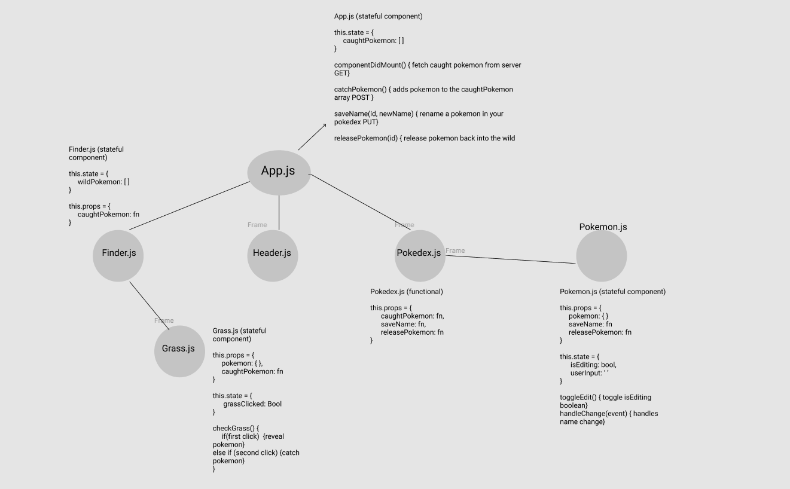
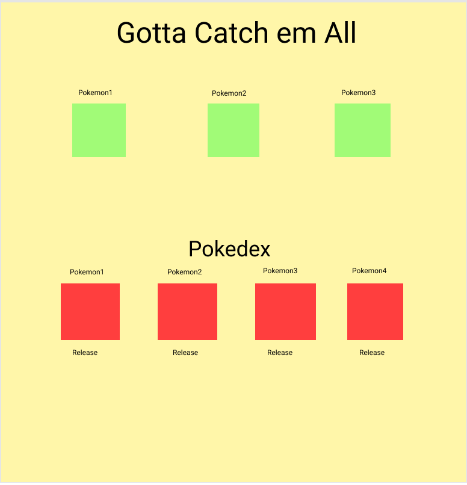

# Pokemon Catching App

## Application Concept and Wireframe
### Application Concept
- This is a pokemon catching app
- We will be utilizing the pokeAPI for the pokemon data.
- Full CRUD
    - GET: get all pokemon.
    - POST: Caught Pokemon will be posted to our array.
    - PUT: Give the pokemon a name.
    - DELETE: Release the Pokemon back into the wild.

### Functionality
- We want a header at the top of the page to display the name of our app.
- When the app loads, three images of grass will be loaded on the screen.
    - When the grass is clicked we will reveal a wild Pokemon.
- Once we select a Pokemon, we will push that Pokemon to our pokedex.
- The pokedex will show the new caught Pokemon.
- The pokedex will show the name of the caught Pokemon.
- The pokedexc will have a button to release the Pokemon.
- The pokedex will update when the pokemon is released.

### Endpoints 
- GET - Fetch 3 random Pokemon from pokeAPI (retrieve it on front/back).
- GET - Fetch our pokedex.
- POST - Push caught Pokemon to our pokedex.
- PUT - Change Pokemon name.
- DELETE - delete our pokemon from our pokedex.

### Componenet Architecture
- App.js (stateful: hold our caught pokemon information, this.state.caughtPokemon)
    - Header.js (functional)
    - Finder.js (stateful: axios request to fetch the 3 wild Pokemon)
        -Grass.js (stateful: this.state.grassClicked)
    - Pokedex.js (functional)
        -Pokemon.js (stateful: this.state.name, this.state.editing)

### Wireframe

